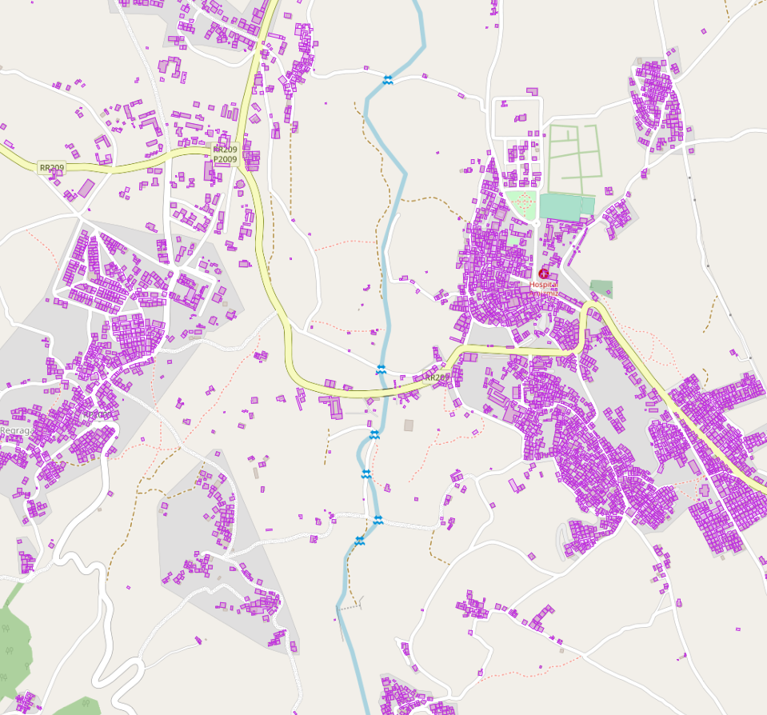

# Morocco Google Buildings

Turn Morocco Google Buildings into PMTiles

## Demo

https://wipfli.github.io/morocco-google-buildings

<a href="https://wipfli.github.io/morocco-google-buildings">

</a>

## Steps

Download the source dataset...
```
axel -a -n 10 https://data.humdata.org/dataset/c6059279-4521-4b39-8b18-d43aedc012c3/resource/6af2ee44-1807-4fb7-a647-a42fc7ffbff0/download/open_buildings_v3_morocco_epicenter.csv.gz
```

Unzip...
```
gunzip open_buildings_v3_morocco_epicenter.csv.gz
```

Convert CSV to GeoJSON...
```
python3 convert.py
```

Filter out some strange geometries...
```
python3 filter.py
```

Run tippecanoe...
```
tippecanoe -z14 -Z14 -l buildings -f -o morocco-google-buildings.pmtiles buildings-filtered.json
```

## Download Vector Tiles

https://pub-726b01260c98468a9387cc0dfcb7386b.r2.dev/morocco-google-buildings.pmtiles (247 MB)
